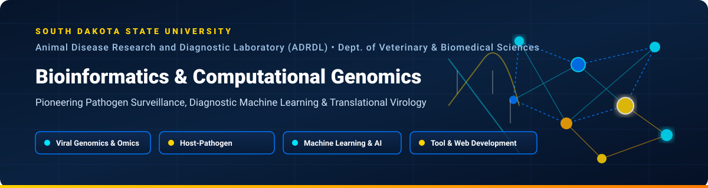

<div align="center">



# Bioinformatics & Computational Genomics Group
### Animal Disease Research and Diagnostic Laboratory (ADRDL)
**Department of Veterinary and Biomedical Sciences • South Dakota State University**

[](https://github.com/sdsubioinfo)
[](https://www.sdstate.edu/veterinary-biomedical-sciences/animal-disease-research-diagnostic-lab)
[](https://www.sdstate.edu/veterinary-biomedical-sciences/animal-disease-research-diagnostic-lab)
[](https://www.python.org/)
[](https://www.nextflow.io/)
[](https://pytorch.org/)
[](LICENSE)

<br/>

**Advancing Veterinary Diagnostics • Infectious Disease Genomics • Pathogen Machine Learning • One Health Surveillance**

</div>

---

## 🔬 Overview & Mission

The **Bioinformatics and Computational Genomics Group** at the **Animal Disease Research and Diagnostic Laboratory (ADRDL)**, within the **Department of Veterinary and Biomedical Sciences at South Dakota State University (SDSU)**, is dedicated to developing cutting-edge computational methods, machine-learning algorithms, and automated genomic pipelines for veterinary clinical medicine and agricultural biosecurity.

Our laboratory serves as a frontline reference diagnostic center for livestock, poultry, wildlife, and companion animal diseases across the United States and internationally. By merging high-throughput next-generation sequencing (Illumina & Oxford Nanopore) with advanced bioinformatics and statistical machine learning, we:

1. **Rapidly Identify & Characterize Emerging Pathogens**: Transitioning raw clinical sequencing directly into actionable diagnostic genotypes and risk profiles.
2. **Track Multi-Segment Viral Reassortment**: Deciphering whole-genome constellations in segmented RNA viruses (e.g., Avian Orthoreovirus, Influenza A, Rotavirus).
3. **Innovate Diagnostic Machine Learning**: Engineering alignment-free, open-set classification systems capable of recognizing known viral clades while explicitly rejecting novel or non-target viral lineages.
4. **Quantify Host Adaptation & Codon Selection**: Dissecting translational selection pressures, synonymous codon bias, and cross-species transmission barriers.
5. **Monitor Antimicrobial Resistance (AMR) & Virulence**: Characterizing bacterial resistomes, mobilomes, and outbreak transmission networks to safeguard animal health and food safety.

---

## 🧬 Core Research & Diagnostic Pillars

```
                      ┌───────────────────────────────────────────────┐
                      │ SDSU ADRDL Clinical & Field Diagnostic Samples│
                      └──────────────────────┬────────────────────────┘
                                             │ High-Throughput WGS / Metagenomics
                                             ▼
       ┌─────────────────────────────────────┬─────────────────────────────────────┐
       │                                     │                                     │
       ▼                                     ▼                                     ▼
┌──────────────┐                     ┌──────────────┐                     ┌──────────────┐
│  Viral WGS & │                     │ Diagnostic AI│                     │ Codon Usage &│
│Constellations│                     │ & Open-Set ML│                     │Host Evolution│
└──────┬───────┘                     └──────┬───────┘                     └──────┬───────┘
       │                                     │                                     │
       │ • 10-Segment ARV Profiling          │ • Alignment-free k-mers             │ • CAI, RSCU, ENC, SiD
       │ • PRRSV, IAV, Rotavirus             │ • Out-of-distribution rejection     │ • Cross-species transmission
       │ • Reassortment surveillance         │ • Subtype & segment gate            │ • Synonymous design
       ▼                                     ▼                                     ▼
       └─────────────────────────────────────┬─────────────────────────────────────┘
                                             │
                                             ▼
                      ┌───────────────────────────────────────────────┐
                      │    Actionable Clinical Reports & Vaccines     │
                      │  Veterinary Producers • Regulators • Research │
                      └───────────────────────────────────────────────┘
```

### 1. 🦠 Segmented Viral Genomics & Constellation Profiling
- Complete ten-segment constellation genotyping ($L1–L2–L3–M1–M2–M3–S1–S2–S3–S4$) for Avian Orthoreoviruses (ARV).
- Molecular epidemiology of porcine reproductive and respiratory syndrome virus (PRRSV), swine enteric coronaviruses, and avian respiratory complexes.
- Real-time tracking of segment reassortment events, antigenic drift, and homologous recombination.

### 2. 🤖 Diagnostic Machine Learning & Open-Set Classifier Engineering
- **Alignment-Free Sequence Representation**: Canonical reverse-complement-invariant $k$-mer encoding for rapid, reference-free sequence processing.
- **Open-Set Prototype Rejection**: Deep neural classifiers integrated with geometric prototype-distance gating that reject unknown/novel strains rather than producing dangerous misclassifications.
- **Hierarchical Gating Architecture**: Two-stage neural networks that simultaneously verify genomic segment identity and assign high-resolution genotypes.

### 3. 🧪 Codon Adaptation & Translational Selection
- **Systematic Codon Metrics**: Codon Adaptation Index (CAI), Effective Number of Codons (ENC), Relative Synonymous Codon Usage (RSCU), and Codon Pair Bias.
- **Multi-Host Fitness Profiling**: Similarity Index ($SiD$), Relative Codon Deoptimization Index ($RCDI$), and correspondence analysis across poultry, swine, bovine, and human hosts.
- **Therapeutic & Vaccine Engineering**: Constrained synonymous sequence optimization and deoptimization balancing dinucleotide biases (CpG/UpA) with host translation efficiency.

### 4. 🛡️ Bacterial Pathogenomics & Antimicrobial Resistance (AMR)
- High-resolution hybrid assembly ($Short + Long$ reads) for veterinary bacterial pathogens (*Salmonella*, *E. coli*, *Pasteurella multocida*, *Streptococcus suis*).
- Comprehensive resistome, plasmidome, and virulome cataloging.
- Phylogenomic contact tracing for nosocomial, herd-level, and processing facility disease outbreaks.

---

## 🚀 Flagship Software & Tools

| Repository | Primary Language | Description | Documentation / Status |
| :--- | :--- | :--- | :--- |
| [**`ReoGenotyper`**](https://github.com/sdsubioinfo/ReoGenotyper) | Python / PyTorch | Alignment-free open-set neural classifier for avian orthoreovirus (ARV) segment identification, 10-segment genotype prediction, and constellation assembly. | [](https://github.com/sdsubioinfo/ReoGenotyper) |
| [**`CodonAdaptPy`**](https://github.com/sdsubioinfo/CodonAdaptPy) | Python 3.10+ | Comprehensive framework for coding sequence validation, multi-host codon adaptation metrics, molecular evolution diagnostics, and constrained synonymous design. | [](https://pypi.org/project/CodonAdaptPy/) [](https://codonadaptpy.readthedocs.io/) |
| [**`TraceDB-Genotyper`**](https://github.com/sdsubioinfo/tracedb) | Python / MAFFT | High-throughput pairwise nucleotide identity clustering and UPGMA classification pipeline for viral surveillance. | [](https://github.com/sdsubioinfo/tracedb) |
| [**`VetPath-Workflows`**](https://github.com/sdsubioinfo) | Nextflow / Docker | Production-grade Nextflow and Snakemake pipelines for automated clinical WGS consensus assembly, variant calling, and quality control. | [](https://github.com/sdsubioinfo) |

---

## 💻 Bioinformatic Technology Stack

```
   ┌────────────────────────────────────────────────────────────────────────┐
   │                       COMPUTATIONAL ECOSYSTEM                          │
   ├────────────────────────────────────────────────────────────────────────┤
   │ Languages & Core:     Python (3.10+), R (4.x), Bash, C++, Nextflow     │
   │ Data Science & AI:    PyTorch, Scikit-Learn, SciPy, NumPy, Pandas      │
   │ Dimensionality & Stats:PCA, UMAP, Grouped-LDA, Welch/Mann-Whitney, FDR  │
   │ Sequence Alignment:   MAFFT, Minimap2, BLAST+, Bowtie2, BWA-MEM2       │
   │ Phylogenetics:        IQ-TREE 2 (ModelFinder), FastTree, trimAL, ETE3  │
   │ Genome Assembly:      Flye, Medaka, Unicycler, SPAdes, Canu            │
   │ Packaging & CI/CD:    Conda / Mamba, uv, Docker, Singularity, Actions  │
   │ Diagnostic HPC:       SLURM Cluster Computing, Multi-GPU Nodes        │
   └────────────────────────────────────────────────────────────────────────┘
```

---

## 👥 Laboratory Leadership & Team

- **Dr. Sunil Mor** — *Director / Molecular Diagnostics & Virology Lead*  
  Professor, Animal Disease Research and Diagnostic Laboratory, SDSU  
  📧 `sunil.mor@sdstate.edu`

- **Dr. Naveen Duhan** — *Bioinformatics & Computational Biology Lead*  
  Lead Computational Biologist / Software Architect  
  GitHub: [@navduhan](https://github.com/navduhan) • 📧 `duhan27dec@gmail.com`

- **Dr. Jagathiswaran Radhakrishnan** — *Postdoctoral Research Scholar / Computational Virology*
- **Dipro Sinha** — *Graduate Research Assistant / Machine Learning & Bioinformatics*
- **Dr. Mohamed H. Selim** — *Diagnostic Pathologist / Virologist*
- **Dr. Gun Temeeyasen** — *Veterinary Virologist / Molecular Diagnostics*
- **Dr. Tamer A. Sharafeldin** — *Veterinary Pathologist / Avian Disease Specialist*

---

## 📚 Selected Publications & Preprints

1. **Radhakrishnan, J., Duhan, N., Sinha, D., Selim, M. H., Temeeyasen, G., Sharafeldin, T. A., & Mor, S.** (2026). *ReoGenotyper: an alignment-free open-set neural classifier for avian orthoreovirus segment genotypes and ten-segment constellations.*
2. **Duhan, N., et al.** (2026). *CodonAdaptPy: Standalone Python package for codon-usage, host-adaptation, and molecular-evolution analysis.* PyPI: [CodonAdaptPy](https://pypi.org/project/CodonAdaptPy/).
3. **Mor, S., et al.** *Genomic epidemiology, multi-segment reassortment dynamics, and diagnostic classification of emerging avian and swine viral pathogens.*

---

## 🤝 Collaborations & Diagnostic Inquiries

We actively collaborate with diagnostic laboratories, veterinary colleges, state/federal veterinary epidemiologists (USDA, state agencies), and agricultural industry partners.

- **Diagnostic Service & Sequencing Queries**: Contact ADRDL main office or Dr. Sunil Mor (`sunil.mor@sdstate.edu`).
- **Software Bug Reports & Contributions**: Open an issue in the respective [sdsubioinfo repository](https://github.com/sdsubioinfo).
- **Academic & Computational Collaborations**: Contact Dr. Naveen Duhan (`duhan27dec@gmail.com`).

---

## 🏛️ Institutional Affiliation

```
Animal Disease Research and Diagnostic Laboratory (ADRDL)
Department of Veterinary and Biomedical Sciences
South Dakota State University
Veterinary Medical Research Complex (VMRC)
Box 2175, Brookings, SD 57007, USA
Website: https://www.sdstate.edu/veterinary-biomedical-sciences/animal-disease-research-diagnostic-lab
```

<div align="center">
  <sub>© 2026 South Dakota State University ADRDL Bioinformatics Group. Developed with pride in Brookings, South Dakota.</sub>
</div>
